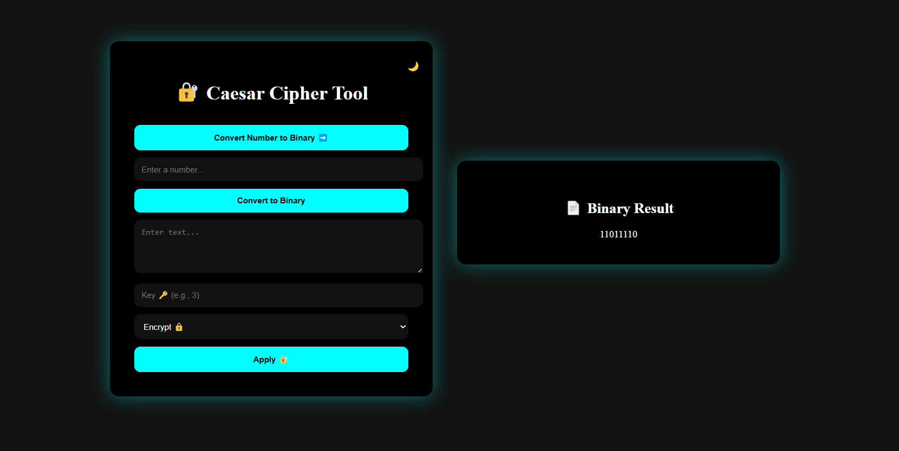
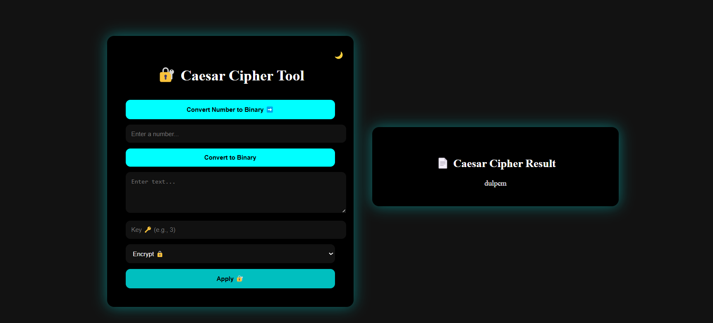

# 🔐 Caesar Cipher & Binary Converter Tool

A simple Python Flask web app to **encrypt/decrypt text** using the **Caesar Cipher** and convert numbers to **Binary**.

---

## 🚀 Features

- Caesar Cipher **Encrypt/Decrypt** 🔒
- **Binary Number Converter** 🔢
- **Dark/Light Mode** Toggle 🌙☀️
- **Responsive UI**

---

## 📸 Screenshots

### 🔢 Binary Converter


### 🔐 Caesar Cipher Result


---

## 🛠️ Installation

```bash


Install required libraries with:


1---->Web framework for building the web app.
pip install Flask
2--->Used internally by Flask for routing and web server functionalities.
pip install Werkzeug

Optional Libraries
--> pip install numpy
---> python-dotenv